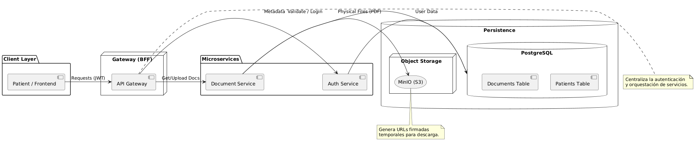

## Create docker
```sh
cd medical
docker compose up -d
```

## Run proyect
```sh
cd medical
npx nx run-many --target=serve
```

## swagger documentation

gateway
<a href="http://localhost:3000/docs"> http://localhost:3000/docs </a>

auth
<a href="http://localhost:3001/docs"> http://localhost:3001/docs </a>

document
<a href="http://localhost:3002/docs"> http://localhost:3002/docs </a>


# Resumen de Decisiones Técnicas - Sistema de Gestión Médica

## 1. Arquitectura de Microservicios con Nx Monorepo
Se seleccionó **Nx** para gestionar el proyecto como un monorepo. Esta decisión permite:
* **Código compartido:** Uso de librerías comunes (`shared-dto`, `auth-guard`, `database`) para garantizar la consistencia de los datos.
* **Escalabilidad:** Cada microservicio (`auth`, `document`, `gateway`) puede escalar de forma independiente según la carga.



## 2. Implementación de BFF (Backend For Frontend)
El **Gateway** actúa como un punto de entrada único.
* **Simplificación para el cliente:** El frontend solo conoce una URL.
* **Seguridad:** El Gateway valida los tokens JWT antes de permitir que la petición llegue a los microservicios internos.

## 3. Almacenamiento Seguro con MinIO (S3)
En lugar de almacenar archivos en el sistema de archivos local, se optó por un **Object Storage**.
* **URLs Firmadas:** Se cumple el requisito 3.3 mediante la generación de URLs temporales que expiran en 5 minutos, garantizando que los documentos clínicos nunca sean públicos.
* **Desacoplamiento:** Los archivos están separados de la base de datos de metadatos.

## 4. Seguridad y Validación de Datos
* **Hashing con Bcrypt:** Las contraseñas (incluyendo las temporales) nunca se guardan en texto plano.
* **Validación en múltiples capas:**
    * **DTOs:** Uso de `class-validator` y `class-transformer` para validar tipos de datos en la entrada.
    * **Enums:** Implementación de tipos estrictos para documentos (`Concepto médico`, `Paraclínicos`, `Exámenes complementarios`) para evitar datos basura.
* **Validación de Propiedad:** El sistema verifica que el `patient_id` del token JWT coincida con el dueño del documento solicitado antes de permitir la descarga.

## 5. Base de Datos Relacional (PostgreSQL)
Se utilizó PostgreSQL debido a su robustez y soporte para tipos de datos complejos:
* **UUID:** Uso de identificadores universales únicos para evitar la enumeración de recursos.
* **JSONB:** El campo `metadata` de los documentos utiliza JSON binario para permitir flexibilidad en los datos clínicos sin sacrificar rendimiento.

# Medical

<a alt="Nx logo" href="https://nx.dev" target="_blank" rel="noreferrer"></a>

✨ Your new, shiny [Nx workspace](https://nx.dev) is ready ✨.

[Learn more about this workspace setup and its capabilities](https://nx.dev/nx-api/nest?utm_source=nx_project&amp;utm_medium=readme&amp;utm_campaign=nx_projects) or run `npx nx graph` to visually explore what was created. Now, let's get you up to speed!

## Run tasks

To run the dev server for your app, use:

```sh
npx nx serve gateway
```

To create a production bundle:

```sh
npx nx build gateway
```

To see all available targets to run for a project, run:

```sh
npx nx show project gateway
```

These targets are either [inferred automatically](https://nx.dev/concepts/inferred-tasks?utm_source=nx_project&utm_medium=readme&utm_campaign=nx_projects) or defined in the `project.json` or `package.json` files.

[More about running tasks in the docs &raquo;](https://nx.dev/features/run-tasks?utm_source=nx_project&utm_medium=readme&utm_campaign=nx_projects)

## Add new projects

While you could add new projects to your workspace manually, you might want to leverage [Nx plugins](https://nx.dev/concepts/nx-plugins?utm_source=nx_project&utm_medium=readme&utm_campaign=nx_projects) and their [code generation](https://nx.dev/features/generate-code?utm_source=nx_project&utm_medium=readme&utm_campaign=nx_projects) feature.

Use the plugin's generator to create new projects.

To generate a new application, use:

```sh
npx nx g @nx/nest:app demo
```

To generate a new library, use:

```sh
npx nx g @nx/node:lib mylib
```

You can use `npx nx list` to get a list of installed plugins. Then, run `npx nx list <plugin-name>` to learn about more specific capabilities of a particular plugin. Alternatively, [install Nx Console](https://nx.dev/getting-started/editor-setup?utm_source=nx_project&utm_medium=readme&utm_campaign=nx_projects) to browse plugins and generators in your IDE.

[Learn more about Nx plugins &raquo;](https://nx.dev/concepts/nx-plugins?utm_source=nx_project&utm_medium=readme&utm_campaign=nx_projects) | [Browse the plugin registry &raquo;](https://nx.dev/plugin-registry?utm_source=nx_project&utm_medium=readme&utm_campaign=nx_projects)

## Set up CI!

### Step 1

To connect to Nx Cloud, run the following command:

```sh
npx nx connect
```

Connecting to Nx Cloud ensures a [fast and scalable CI](https://nx.dev/ci/intro/why-nx-cloud?utm_source=nx_project&utm_medium=readme&utm_campaign=nx_projects) pipeline. It includes features such as:

- [Remote caching](https://nx.dev/ci/features/remote-cache?utm_source=nx_project&utm_medium=readme&utm_campaign=nx_projects)
- [Task distribution across multiple machines](https://nx.dev/ci/features/distribute-task-execution?utm_source=nx_project&utm_medium=readme&utm_campaign=nx_projects)
- [Automated e2e test splitting](https://nx.dev/ci/features/split-e2e-tasks?utm_source=nx_project&utm_medium=readme&utm_campaign=nx_projects)
- [Task flakiness detection and rerunning](https://nx.dev/ci/features/flaky-tasks?utm_source=nx_project&utm_medium=readme&utm_campaign=nx_projects)

### Step 2

Use the following command to configure a CI workflow for your workspace:

```sh
npx nx g ci-workflow
```

[Learn more about Nx on CI](https://nx.dev/ci/intro/ci-with-nx#ready-get-started-with-your-provider?utm_source=nx_project&utm_medium=readme&utm_campaign=nx_projects)

## Install Nx Console

Nx Console is an editor extension that enriches your developer experience. It lets you run tasks, generate code, and improves code autocompletion in your IDE. It is available for VSCode and IntelliJ.

[Install Nx Console &raquo;](https://nx.dev/getting-started/editor-setup?utm_source=nx_project&utm_medium=readme&utm_campaign=nx_projects)

## Useful links

Learn more:

- [Learn more about this workspace setup](https://nx.dev/nx-api/nest?utm_source=nx_project&amp;utm_medium=readme&amp;utm_campaign=nx_projects)
- [Learn about Nx on CI](https://nx.dev/ci/intro/ci-with-nx?utm_source=nx_project&utm_medium=readme&utm_campaign=nx_projects)
- [Releasing Packages with Nx release](https://nx.dev/features/manage-releases?utm_source=nx_project&utm_medium=readme&utm_campaign=nx_projects)
- [What are Nx plugins?](https://nx.dev/concepts/nx-plugins?utm_source=nx_project&utm_medium=readme&utm_campaign=nx_projects)

And join the Nx community:
- [Discord](https://go.nx.dev/community)
- [Follow us on X](https://twitter.com/nxdevtools) or [LinkedIn](https://www.linkedin.com/company/nrwl)
- [Our Youtube channel](https://www.youtube.com/@nxdevtools)
- [Our blog](https://nx.dev/blog?utm_source=nx_project&utm_medium=readme&utm_campaign=nx_projects)


testing
```sh
npx nx test auth --skip-nx-cache
npx nx test gateway --skip-nx-cache

``